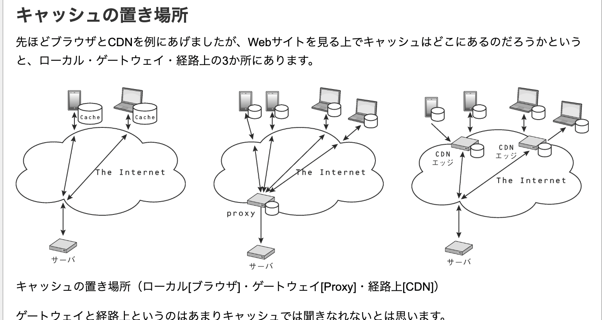

# HTTPキャッシュ入門の入門

**キャッシュを誰使用するのか・再利用を誰がする**
- 特定のクライアントのみが参照可能なキャッシュ(private cache)
- 複数のクライアントから参照可能なキャッシュ(shared cache)

> そもそもキャッシュとは何をどうしようとしているのか
[HTTPキャッシュ入門の入門](https://blog.xcir.net/?p=2806)

[HTTP キャッシュ](https://developer.mozilla.org/ja/docs/Web/HTTP/Guides/Caching)
